# Изучение SIMD-функций на примере алгоритма построения множества Мандельброта

В данной работе я исследую различные способы оптимизации одного из вычислительно затратных алгоритмов - построение множества Мандельброта. В частности, анализируются как оптимизации, автоматически выполняемые компиляторами g++ и clang++, так и ручные преобразования кода, направленные на ускорение вычислений с помощью SIMD-инструкций.

Если вам интересно собрать проект, то инструкции по сборке представлены [ниже](#Сборка-и-запуск)

## Рассматриваемый алгоритм

Построение множества Мандельброта происходит следующим образом:

1. Выбирается область на комплексной плоскости, которую хотим визуализировать.

2. Для каждой точки $z_{0} = (x_{0}, y_{0})$  из этой области на каждом шаге координаты пересчитываются по формулам:

$$
x_{n} = x_{n-1}^2 - y_{n-1}^2 + x_{0} 
$$

$$
y_{n} = 2 x_{n-1} y_{n-1} + y_{0}
$$

3. Итерации продолжаются до тех пор, пока модуль значения $z_{n}$  не превышает заданный порог $R_{max}$ или не достигается ограничение на число шагов.

4. Цвет точки $z_{0}$ определяется тем, сколько итераций понадобилось, чтобы модуль значения $z_{n}$ превысил $R_{max}$ (или тем, что он не превысил вообще).

5. После того как для всех точек множества вычислены цвета, полученное изображение выводится на экран.

Пример построенного множества:

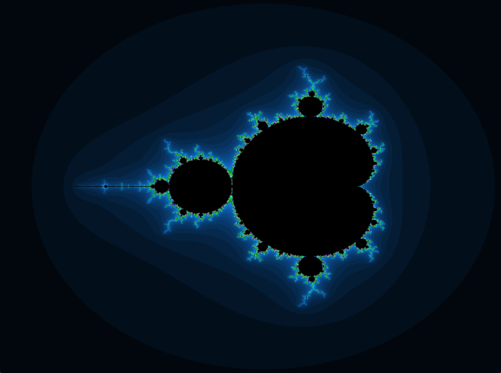

## План работы

В работе рассматриваются три реализации алгоритма:

1. Последовательная обработка точек без использования векторизации.

2. Реализация с использованием массивов - обработка ведётся блоками по 4 точки, что позволяет компилятору распознать возможность векторизации.

3. Применяются явные SIMD-инструкции для параллельной обработки нескольких точек.

## Методика тестирования

Для измерения времени выполнения используется функция `clock_gettime` с таймером `CLOCK_MONOTONIC_RAW`.

Данная функция возвращает время, считываемое напрямую с аппаратного таймера и не подверженное корректировкам со стороны операционной системы. В частности, это исключает влияние любых механизмов коррекции времени со стороны ОС: как скачкообразных (`NTP`), так и плавных (`adjtime`), а также внутренних поправок ядра, применяемых к `CLOCK_MONOTONIC`.

Используется следующая схема замеров:

- В одном тесте таймер запускается перед началом серии из 100 последовательных запусков алгоритма и останавливается после её завершения. Это позволяет снизить влияние погрешности, возникающей при измерении времени с помощью clock_gettime
- Каждая реализация тестируется 40 раз:
  - первые 10 запусков считаются разогревочными: они нужны для прогрева кэшей и стабилизации частоты процессора, поэтому их результаты не сохраняются для дальнейшего анализа;
  - оставшиеся 30 запусков используются при обработке результатов.
- Для каждой реализации проводится 3 независимых серии измерений.


Код компилируется с флагами:

```
-march=native -Wall -Wextra
```

- `-march=native` позволяет использовать все доступные инструкции процессора (включая SIMD);
- `-Wall -Wextra` помогают избежать ошибки в реализации, вызывающие неопределенное поведение

Эксперименты проводились на процессоре `Intel Core Ultra 9 285H`, операционная система `Linux 6.18.18-1-MANJARO`

Выполнение закреплялось за конкретным ядром `taskset -c 3 ./program` и ядро изолировалось от планировщика ОС `GRUB_CMDLINE_LINUX_DEFAULT="isolcpus=3"`

Также в процессе замеров контролировалось, что тактовая частота процессора фиксирована и отсутствует тротлинг.

## Сравнение различных реализаций алгоритма

Каждая реализация компилировалась с использованием компиляторов g++ и clang++ с флагами оптимизации -O2 и -O3. Я выбрала эти уровни оптимизации, поскольку они чаще всего используются на практике.

### Обоснование необходимости отключения отрисовки

Покажем, что отрисовка множества Мандельброта вносит статистически значимый вклад в общее время выполнения программы. Для этого после каждого теста дополнительно вызывается функция отрисовки.

Нулевая гипотеза - распределения времени выполнения с отрисовкой и без неё совпадают, то есть различия между измерениями отсутствуют. Уровень значимости принят равным $\alpha = 0.05$. Для проверки гипотезы используется U-критерий Манна–Уитни.

| Реализация\Компилятор\Оптимизация | p-value |
|-----------|-----------|
| Naive g++ -O2  | $5 \cdot 10^{-31}$  |
| Naive clang++ -O2       |  $3 \cdot 10^{-30}$       |
| Naive g++ -O3       |   $9 \cdot 10^{-30}$     |
| Naive clang++ -O3       |  $10 \cdot 10^{-31}$        |
| Array g++ -O2  | $5 \cdot 10^{-31}$  |
| Array clang++ -O2       | $5 \cdot 10^{-31}$        |
| Array g++ -O3       |    $6 \cdot 10^{-31}$       |
| Array clang++ -O3       | $6 \cdot 10^{-30}$        |
| SIMD g++ -O2  | $5 \cdot 10^{-31}$  |
| SIMD clang++ -O2       |   $5 \cdot 10^{-31}$       |
| SIMD g++ -O3       |   $7 \cdot 10^{-31}$      |
| SIMD clang++ -O3       |   $1 \cdot 10^{-31}$       |

Во всех случаях нулевая гипотеза отвергается, что свидетельствует о статистически значимом влиянии отрисовки на время выполнения.

Поскольку в эксперименте сравнивается именно скорость различных реализаций алгоритма, в замерах учитывается только построение множества Мандельброта. Этап отрисовки изображения отключается, чтобы не искажать результаты измерений.

### Наивная реализация

Посмотрим на асимптотические доверительные интервалы* времени работы алгоритма при уровне значимости $\alpha = 0.05$

Так как число измерений достаточно велико, по центральной предельной теореме выборочное среднее можно считать примерно нормально распределённым. Это позволяет использовать асимптотические доверительные интервалы для оценки погрешности среднего времени выполнения.

| Компилятор/Оптимизация | Доверительный интервал времени работы | 
|------------------------|---------------|
| g++ -O2                |  4.581 (± 0.003)    | 
| g++ -O3                |  4.591 (± 0.004)  | 
| clang++ -O2            |  4.517 (± 0.004)    | 
| clang++ -O3            |  4.510 (± 0.003)    | 


Проверим, имеются ли статистически значимые различия во времени работы алгоритма при использовании различных компиляторов и уровней оптимизации. Для этого применим U-критерий Манна–Уитни.
Нулевая гипотеза - распределения времени выполнения совпадают.

Матрица попарных p-value U-критерия Манна–Уитни

| Компилятор/Оптимизация | g++ -O2 | g++ -O3 | clang++ -O2            | clang++ -O3 | 
|------------------------|----------|---------|--------------- |---------------|
| g++ -O2                |  -      | 0.002   | $2 \cdot 10^{-29}$      |  $2 \cdot 10^{-30}$    | 
| g++ -O3                |  0.002  | -       |  $4 \cdot 10^{-30}$      | $1 \cdot 10^{-30}$   | 
| clang++ -O2            |   $2 \cdot 10^{-29}$      |   $4 \cdot 10^{-30}$    |  -    | 0.04    | 
| clang++ -O3            |  $2 \cdot 10^{-30}$    | $1 \cdot 10^{-30}$   |  0.04    |-    | 

Во всех случаях нулевая гипотеза отвергается при уровне значимости $\alpha = 0.05$, что свидетельствует о статистически значимых различиях во времени работы программы.

#### Сравнение ассемлерного кода, сгенерированного компиляторами g++ и clang++ при флаге -О2

Основное различие заключается в том, что g++ не разворачивает циклы, а clang++ - разворачивает. 

g++ :

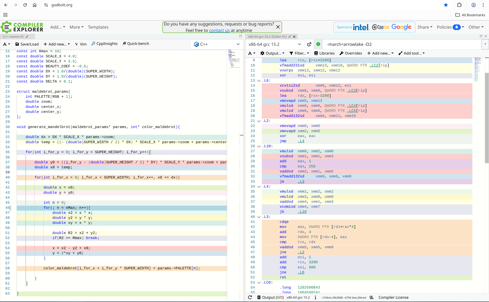

clang++:

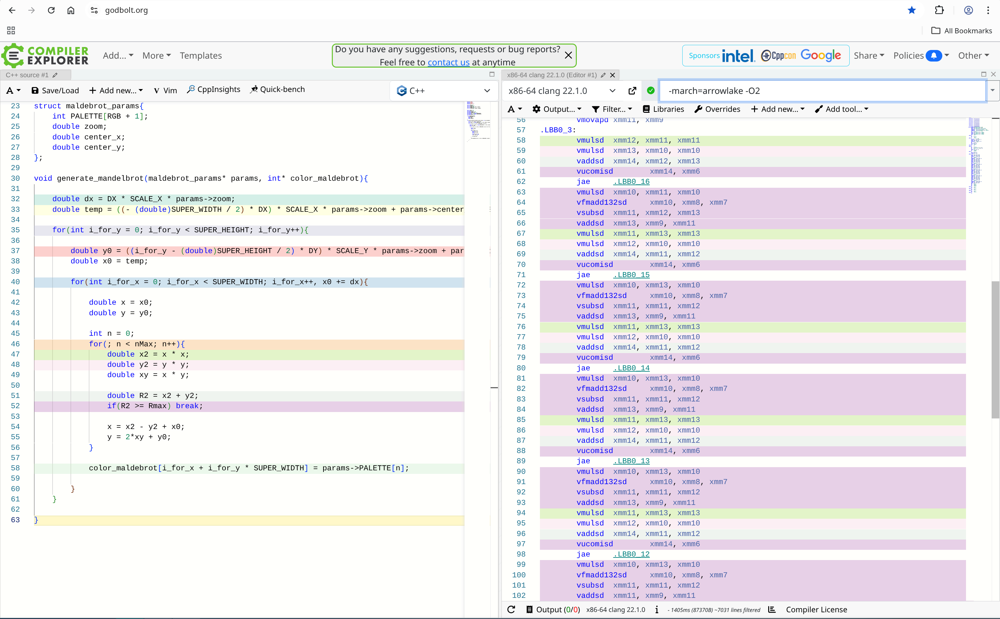

g++ чаще выполняет обращения к памяти внутри цикла, тогда как clang++ активнее использует в регистрах и старается вынести обращения к памяти за пределы цикла. Особенно это можно видеть если посмотреть на ассемблерный код, сгенерированный компиляторами для 
```c
double y0 = ((i_for_y - (double)SUPER_HEIGHT / 2) * DY) * SCALE_Y * params->zoom + params->center_y;
```

g++ :

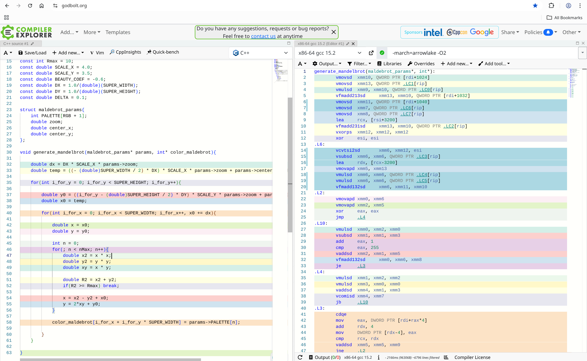

clang++:

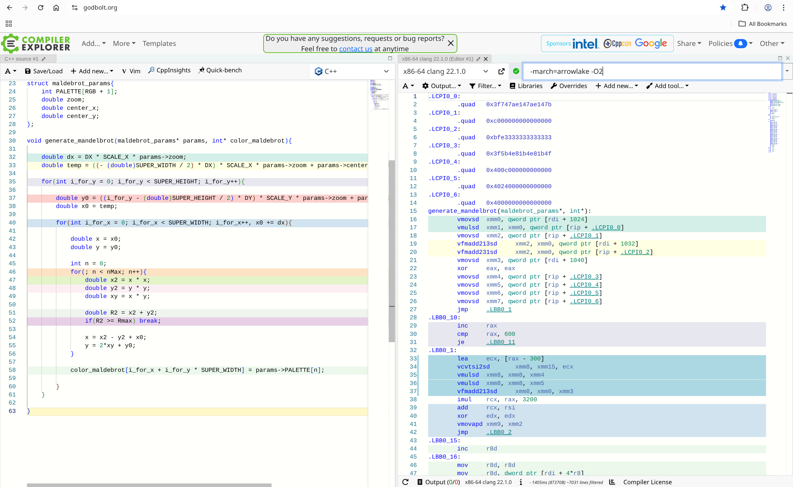

При этом при попарном сравнении уровней оптимизации внутри каждого компилятора (g++ -O2 vs g++ -O3 и clang++ -O2 vs clang++ -O3) ассемблерный код функции `generate_mandelbrot` не изменяется.

### Реализация на массивах

Посмотрим на асимптотические доверительные интервалы времени работы алгоритма при уровне значимости $\alpha = 0.05$

| Компилятор/Оптимизация | Доверительный интервал времени работы  | 
|------------------------|---------------|
| g++ -O2                |  1.850 (± 0.002)  | 
| g++ -O3                |  2.330 (± 0.003)     | 
| clang++ -O2            |  1.684 (± 0.002)    | 
| clang++ -O3            |  1.686 (± 0.003)    | 


Проверим, имеются ли статистически значимые различия во времени работы алгоритма при использовании различных компиляторов и уровней оптимизации. Для этого применим U-критерий Манна–Уитни.
Нулевая гипотеза - распределения времени выполнения совпадают.

Матрица попарных p-value U-критерия Манна–Уитни

| Компилятор/Оптимизация | g++ -O2               |  g++ -O3             | clang++ -O2             | clang++ -O3 | 
|------------------------|-----------------------|----------------------|-------------------------|---------------|
| g++ -O2                |  -                   | $5 \cdot 10^{-31}$    | $5 \cdot 10^{-31}$      |  $5 \cdot 10^{-31}$    | 
| g++ -O3                |  $5 \cdot 10^{-31}$  | -                     |  $5 \cdot 10^{-31}$     | $5 \cdot 10^{-31}$   | 
| clang++ -O2            |  $5 \cdot 10^{-31}$  | $5 \cdot 10^{-31}$    |  -                      | 0.9    | 
| clang++ -O3            |  $5 \cdot 10^{-31}$  | $5 \cdot 10^{-31}$    |  0.9                   |-    | 

Во всех случаях, кроме запуска с компилятором clang++ и флагами -О2 и -О3 нулевая гипотеза отвергается при уровне значимости $\alpha = 0.05$, что свидетельствует о статистически значимых различиях во времени работы программы.


#### Сравнение ассемлерного кода, сгенерированного компиляторами g++ и clang++ при флаге -О2

Clang++ в данном случае агрессивнее применяет векторизацию - активнее использует SIMD-инструкции и также реже обращается к памяти внутри циклов.

Например, для фрагмента

```c
for(int j = 0; j < 4; j++){ x0[j] = X0 + j * dx; }
```

clang++ преобразует цикл в векторный вариант с использованием SIMD-инструкций, тогда как g++ оставляет скалярную реализацию с явными обращениями к памяти.


g++ :

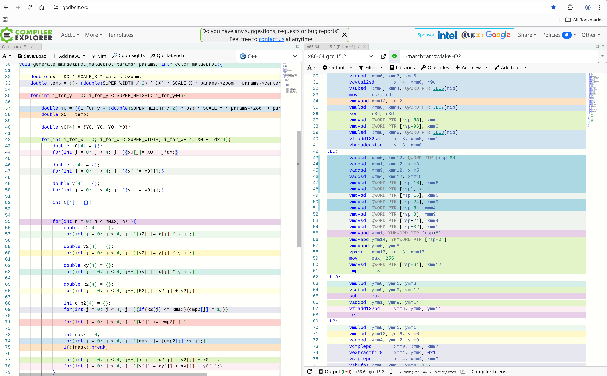

clang++:

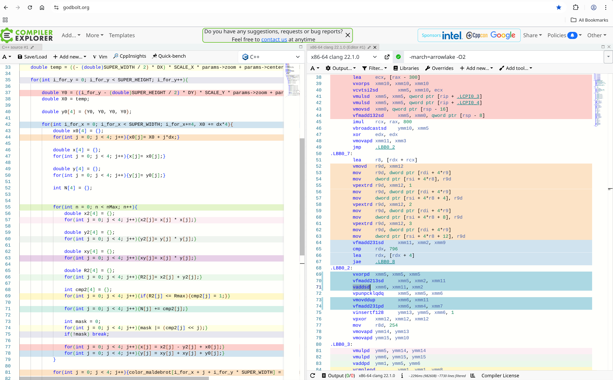


Кроме того, clang++ выполняет развёртку циклов, в то время как g++ этого не делает.

g++ :

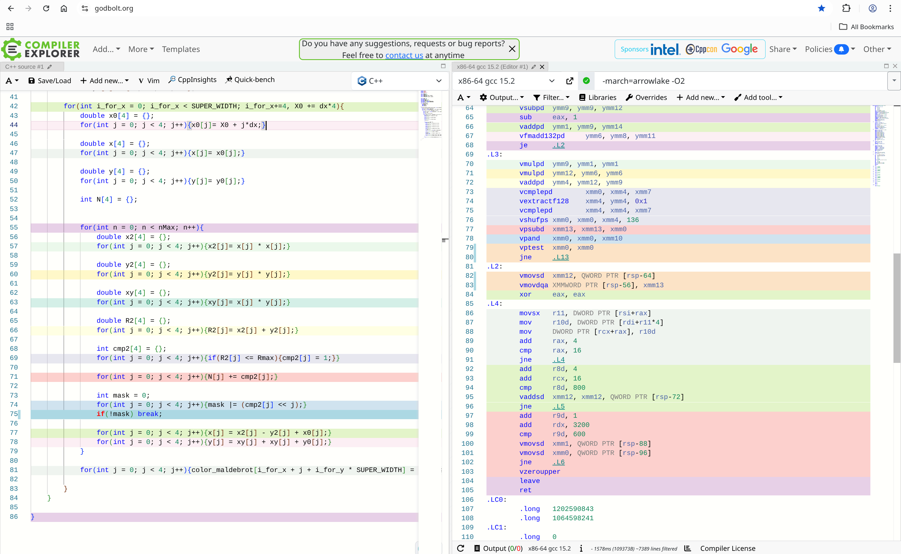

clang++:

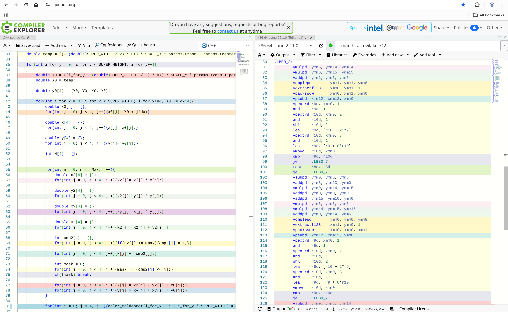

#### Сравнение ассемлерного кода, сгенерированного компилятором g++ при флагах -О2 и -О3

При переходе с -O2 на -O3 результат для g++ не всегда улучшается. В отдельных случаях компилятор начинает реже использовать векторные инструкции и чаще обращаться к памяти.

Рассмотрим фрагмент кода:

```c
for(int j = 0; j < 4; j++){ x2[j] = x[j] * x[j]; }

for(int j = 0; j < 4; j++){ y2[j] = y[j] * y[j]; }
```

На уровне -O2 компилятор использует векторные инструкции, тогда как при -O3 соответствующий код разворачивается в набор отдельных скалярных умножений с дополнительными обращениями к памяти.

g++ -O2 :

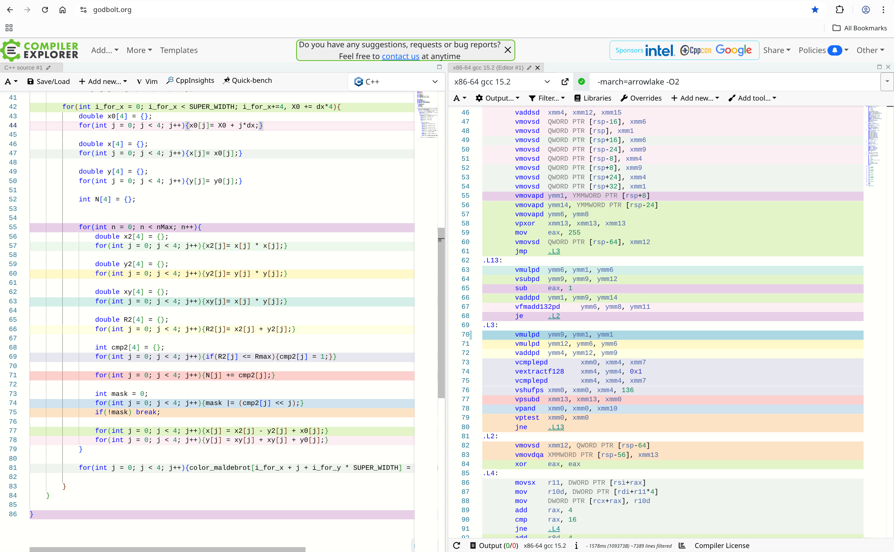

g++ -O3 :

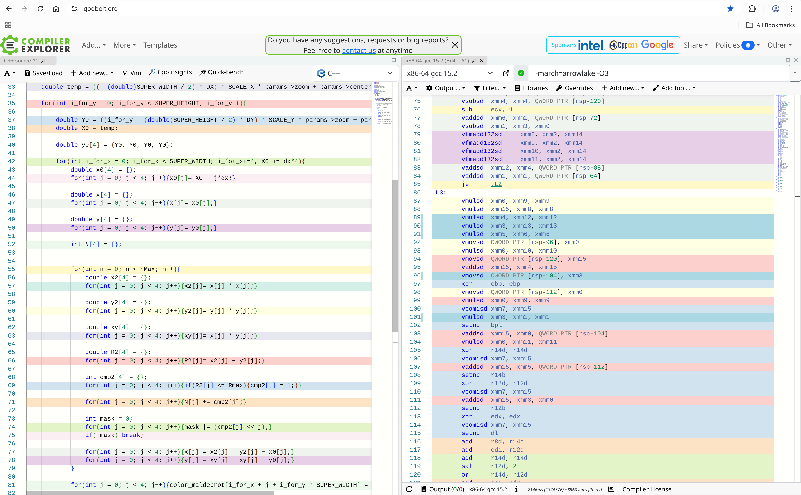

Ассемблерный код, сгенерированный компилятором clang++ при уровнях оптимизации -O2 и -O3 совпадает, что согласуется с результатами измерений - статистически значимых различий во времени выполнения программы не наблюдается.

### SIMD реализация 

Посмотрим на асимптотические доверительные интервалы времени работы алгоритма при уровне значимости $\alpha = 0.05$

| Компилятор/Оптимизация | Доверительный интервал времени работы  | 
|------------------------|---------------|
| g++ -O2                |  1.402 (± 0.002)  | 
| g++ -O3                |  1.405 (± 0.005)     | 
| clang++ -O2            |  1.378 (± 0.001)    | 
| clang++ -O3            |  1.381 (± 0.003)    | 


Проверим, имеются ли статистически значимые различия во времени работы алгоритма при использовании различных компиляторов и уровней оптимизации. Для этого применим U-критерий Манна–Уитни.
Нулевая гипотеза - распределения времени выполнения совпадают.

Матрица попарных p-value U-критерия Манна–Уитни

| Компилятор/Оптимизация | g++ -O2               |  g++ -O3             | clang++ -O2             | clang++ -O3 | 
|------------------------|-----------------------|----------------------|-------------------------|---------------|
| g++ -O2                |  -                   | 0.01                  | $3 \cdot 10^{-28}$      |  $2 \cdot 10^{-20}$    | 
| g++ -O3                |  0.01                | -                     |  $3 \cdot 10^{-29}$     | $5 \cdot 10^{-22}$   | 
| clang++ -O2            |  $3 \cdot 10^{-28}$  | $3 \cdot 10^{-29}$    |  -                      | 0.23    | 
| clang++ -O3            |  $2 \cdot 10^{-20}$  | $5 \cdot 10^{-22}$    |  0.23                   |-    | 

Во всех случаях, кроме запуска с компилятором clang++ и флагами -О2 и -О3 нулевая гипотеза отвергается при уровне значимости $\alpha = 0.05$, что свидетельствует о статистически значимых различиях во времени работы программы.


#### Сравнение ассемлерного кода, сгенерированного компиляторами g++ и clang++ при флаге -О2

Разница во времени выполнения обуславливается тем, что clang++ выполняет развёртку циклов, а g++ этого не делает.

g++ :

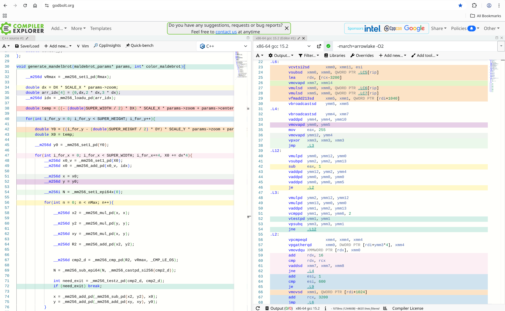

clang++:

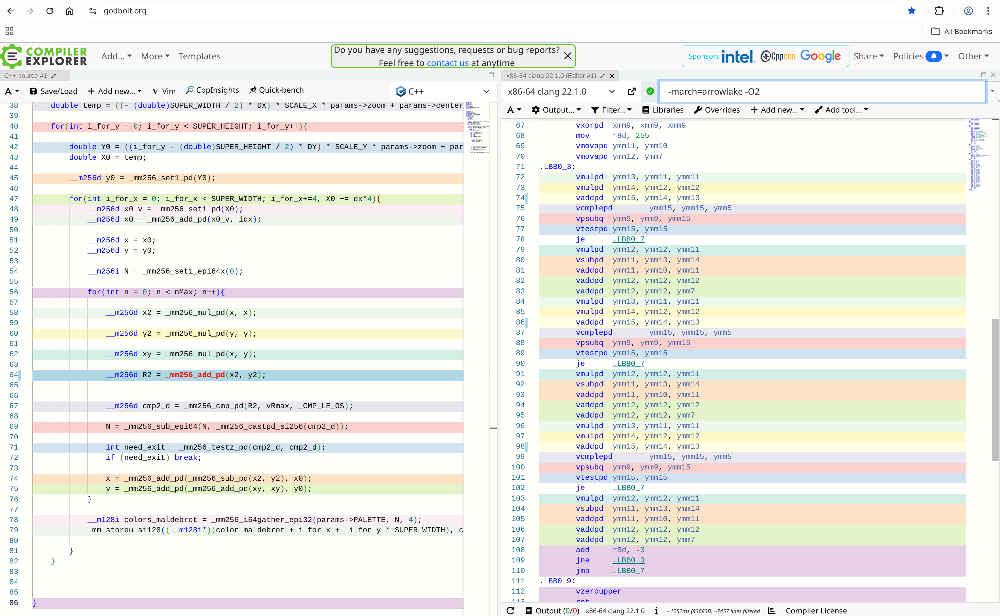

При этом при попарном сравнении уровней оптимизации внутри каждого компилятора (g++ -O2 vs g++ -O3 и clang++ -O2 vs clang++ -O3) ассемблерный код функции `generate_mandelbrot` не изменяется.

В случае clang++ это согласуется с результатами измерений: переход от -O2 к -O3 не приводит к статистически значимым изменениям времени выполнения. 

### Общее сравнение времени работы всех реализаций

Посмотрим на асимптотические доверительные интервалы времени работы всех реализаций алгоритма при уровне значимости $\alpha = 0.05$

| Компилятор/Оптимизация | Naive                     | Array                     | SIMD                      |
|------------------------|---------------------------|---------------------------|---------------------------|
| g++ -O2                | 4.581 (± 0.003)           | 1.850 (± 0.002)           | 1.402 (± 0.002)           |
| g++ -O3                | 4.591 (± 0.004)           | 2.330 (± 0.003)           | 1.405 (± 0.005)           |
| clang++ -O2            | 4.517 (± 0.004)           | 1.684 (± 0.002)           | 1.378 (± 0.001)           |
| clang++ -O3            | 4.510 (± 0.003)           | 1.686 (± 0.003)           | 1.381 (± 0.003)           |


Из таблицы видим, что доверительные интервалы для разных реализаций (Naive, Array, SIMD) практически не пересекаются. При этом разница между средними временами выполнения заметно больше ширины доверительных интервалов. Поэтому различия между реализациями можно считать статистически значимыми без проведения дополнительных тестов.

Посмотрим на ускорения для различных реализаций относительно базовой реализации

| Компилятор/Оптимизация | Array   | SIMD   |
|------------------------|------------------|------------------|
| g++ -O2                | 2.48 раз         | 3.27 раз            |
| g++ -O3                | 1.97 раз             | 3.27 раз            |
| clang++ -O2            | 2.68 раз             | 3.28 раз            |
| clang++ -O3            | 2.67 раз             | 3.26 раз            |


## Выводы

1. Компилятор не всегда сам генерирует наиболее эффективный код, даже при высоких уровнях оптимизации. Если переписать алгоритм так, чтобы он обрабатывал массивы по 4 элемента, часть операций всё равно остаётся скалярной, хотя при ручной оптимизации их можно выполнить с помощью SIMD-инструкций.

2. В теории SIMD-версия, которая считает сразу 4 точки, могла бы ускорить программу в 4 раза. На практике до такого ускорения дойти не получается из-за устройства самого алгоритма.

   В одном ymm-регистре одновременно лежат 4 точки. Проблема в том, что они могут выйти за пределы области за разное число итераций. Например может случиться так что, три точки уже вышли за пределы `Rmax`, а четвёртая ещё нет. В обычной скалярной версии для первых трёх точек вычисления бы уже остановились, но в SIMD-варианте вычисления продолжаются для всего ymm-регистра.

   В коде это место выглядит так:

   ```cpp
   __m256d cmp2_d = _mm256_cmp_pd(R2, vRmax, _CMP_LE_OS);
   N = _mm256_sub_epi64(N, _mm256_castpd_si256(cmp2_d));

   int need_exit = _mm256_testz_pd(cmp2_d, cmp2_d);
   if (need_exit) break;
   ```

   Выйти из цикла можно только когда маска `cmp2_d` стала нулевой, то есть когда когда вычисления для всех четырёх точек завершились.

   Из-за ускорение SIMD-реализаци оказывается меньше теоретического ускорения.

3. Для g++ переход от -O2 к -O3 иногда приводит к ухудшению результата. Это связано с тем, что компилятор отказывается от векторизации в пользу скалярных операций с дополнительными обращениями к памяти.

4. В рассмотренных тестах clang++ в среднем оказался быстрее g++. Это можно связать с тем, что он активнее использовал векторизацию и развёртку циклов, а также чаще держал промежуточные данные в регистрах, меньше обращаясь к памяти.

## Сборка и запуск

```
git clone https://github.com/margocat57/Mandelbrot
cd Mandelbrot_files
make TARGET=<mandelbrot1 | mandelbrot2 | mandelbrot3>  COMPILER=<g++ | clang++> OPT=<O0 | O1 |O2 | O3> run
make clean
```

Изображение можно приближать, отдалять и сдвигать в разные стороны. Для этого используются следующие клавиши:

Увеличение масштаба      — клавиша +
Уменьшение масштаба      — клавиша -
Сдвиг вправо             — стрелка вправо
Сдвиг влево              — стрелка влево
Сдвиг вверх              — стрелка вверх
Сдвиг вниз               — стрелка вниз